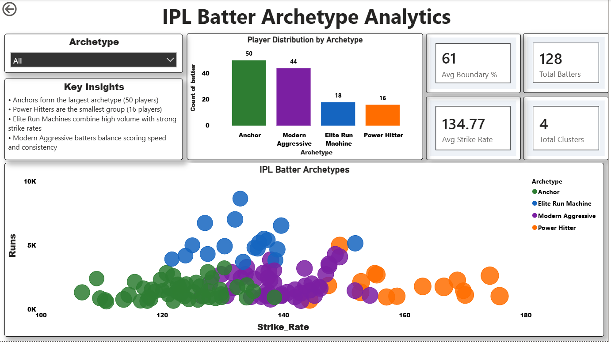
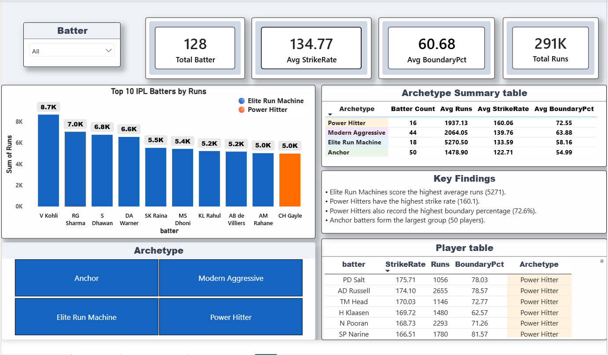
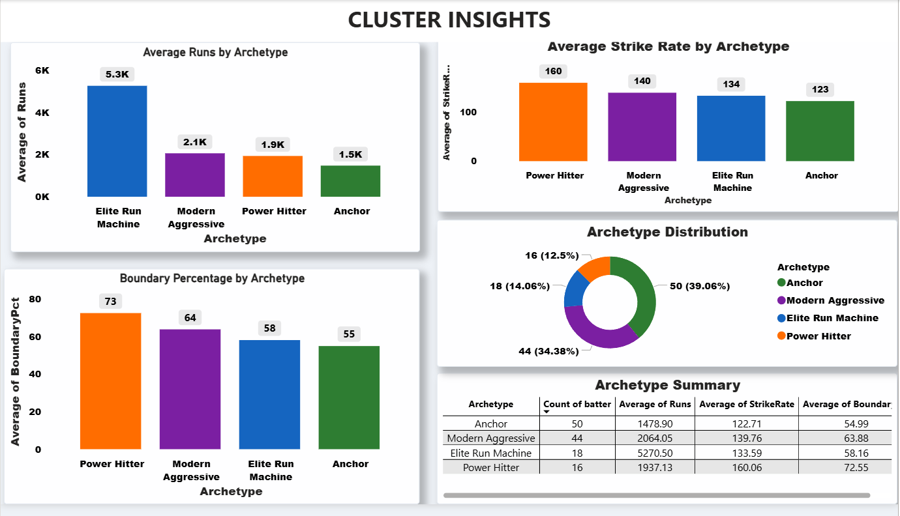

# IPL Batter Archetype Analytics

## Overview

This project analyzes IPL batters using Python, K-Means Clustering, and Power BI to identify different batting archetypes based on player performance metrics.

---

## Dashboard Overview

### Page 1: Executive Dashboard

---

### Page 2: Player Explorer

---

### Page 3: Cluster Insights

---

## Project Workflow

1. Data Cleaning using Pandas
2. Feature Engineering
3. Strike Rate & Boundary Analysis
4. K-Means Clustering
5. Archetype Interpretation
6. Power BI Dashboard Development

---

## Identified Archetypes

| Archetype | Description |
|------------|------------|
| Anchor | Consistent batters who stabilize innings |
| Modern Aggressive | Balance scoring speed and consistency |
| Elite Run Machine | Highest run accumulators |
| Power Hitter | High strike-rate boundary hitters |

---

## Tools Used

- Python
- Pandas
- Scikit-Learn
- Power BI

---

## Key Findings

- Elite Run Machines recorded the highest average runs.
- Power Hitters achieved the highest strike rates.
- Anchors formed the largest player group.
